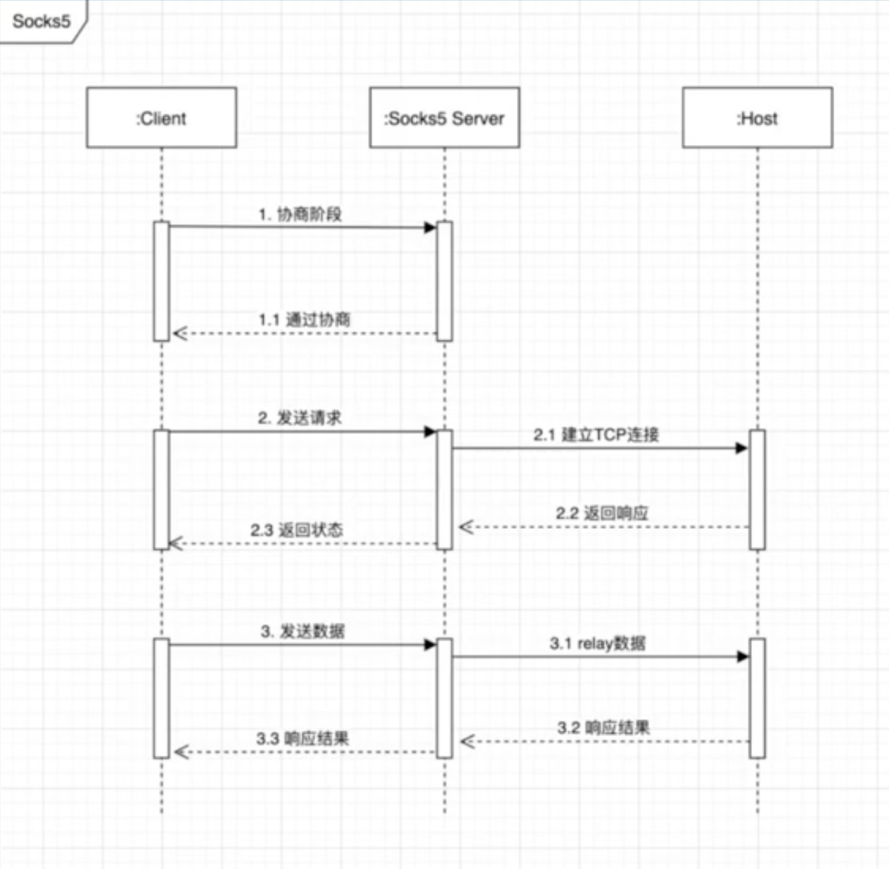
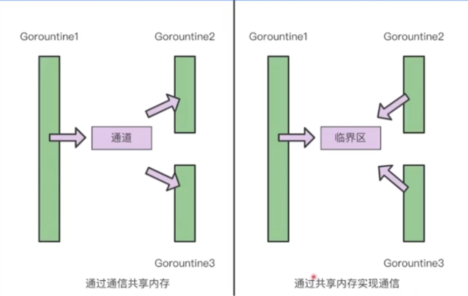
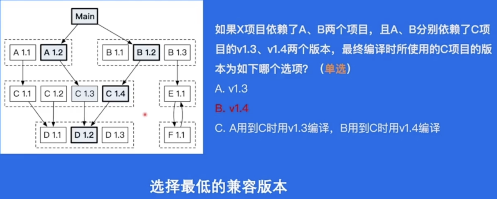
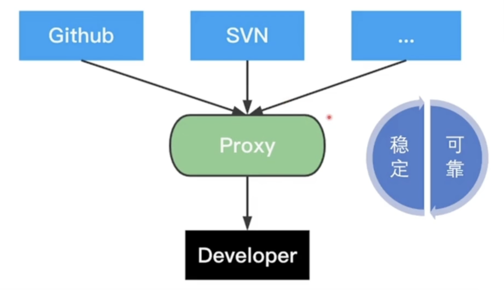

# 01

```shell
go build main.go
./main
go run main.go
go mod init <module_name>
go get github.com/gin-gonic/gin

go test
#format code
go fmt
go doc <package_name>
```

```go
type user struct{
	name string
	password string
}
a:=user{name:"a",password:"b"}
//member function
func (u user)check(password string){
  	return u.password==password
}
//use pointer can change
func (u *user)set(password string){
  	u.password==password
}
```

#### Json

```go
import(
	"encoding/json"
)
//`json:"age"` is struct Tag
type userInfo struct {
    Name  string
    Age   int `json:"age"`
    Hobby []string
}
//encode
a := userInfo{Name: "wang", Age: 18, Hobby: []string{"Golang", "TypeScript"}}
buf,err=json.Marshal(a)
if err!=nil{
  panic(err)
}
//decode
var b userInfo
err=json.Unmarshal(buf,&b)
```

#### strconv

```go
import(
	"strconv"
)
strconv.ParseFloat("1.234", 64)
strconv.ParseInt("111", 10, 64)
strconv.ParseInt("0x1000", 0, 64)
strconv.Atoi("123")
strconv.Itoa(123)
```

#### os

```go
fmt.Println(os.Args)           // [/var/folders/8p/n34xxfnx38dg8bv_x8l62t_m0000gn/T/go-build3406981276/b001/exe/main a b c d]
fmt.Println(os.Getenv("PATH")) // /usr/local/go/bin...
fmt.Println(os.Setenv("AA", "BB"))

buf, err := exec.Command("grep", "127.0.0.1","/etc/hosts").CombinedOutput()
```

# 02 proxy



#### context

`context.WithCancel(parent Context)`

返回一个派生上下文和取消函数。调用取消函数会通知子上下文以及所有与其关联的操作停止。

`context.WithDeadline(parent Context, d time.Time)`

返回一个派生上下文，当时间到达 d 时会自动取消

`context.WithTimeout(parent Context, timeout time.Duration)`

类似于 WithDeadline，但基于超时而不是具体时间点

`context.WithValue(parent Context, key, val interface{})`

返回一个派生上下文，可以存储特定的键值对，适用于元数据传递。

```go
package main

import (
	"context"
	"fmt"
	"time"
)

func main() {
	ctx, cancel := context.WithCancel(context.Background())

	go func(ctx context.Context) {
		for {
			select {
			case <-ctx.Done():
				fmt.Println("Goroutine stopped")
				return
			default:
				fmt.Println("Working...")
				time.Sleep(1 * time.Second)
			}
		}
	}(ctx)

	time.Sleep(3 * time.Second)
	cancel() 
	time.Sleep(1 * time.Second)
}
```

#### Anonymous Function

```go
ctx,cancel:=Context.WithCancel(context.Background())
go func(ctx context.Context){
	
}(ctx)
cancel()
```

# 03

Goroutine user mode, stack KB

Threads kernel mode, stack MB

```go
package main

import (
	"fmt"
	"time"
)

func hello(i int) {
	println("hello goroutine : " + fmt.Sprint(i))
}

func main() {
	for i := 0; i < 5; i++ {
		go func(j int) {
			hello(j)
		}(i)
	}
	time.Sleep(time.Second)
}
```

#### CSP

>  通过通信共享内存，而不是通过共享内存实现通信



Shared memory requires mutex locking; otherwise, it may lead to data races, which can impact performance.

#### Channel

```go
//unbuffered channel
make(chan int)
//buffered channel
make(chan int,2)
```

```go
package main

func main() {
	src := make(chan int)
	dest := make(chan int, 3)

	go func() {
		defer close(src)
		for i := 0; i < 10; i++ {
			src <- i
		}
	}()
	go func() {
		defer close(dest)
		for i := range src {
			dest <- i * i
		}
	}()
	for i := range dest {
		println(i)
	}
}
```

#### Lock

shared memory

```go
package main

import (
	"sync"
	"time"
)

var (
	x    int64
	lock sync.Mutex
)

func addWithLock() {
	for i := 0; i < 2000; i++ {
		lock.Lock()
		x += 1
		lock.Unlock()
	}
}

func main() {
	for i := 0; i < 5; i++ {
		go addWithLock()
	}
	time.Sleep(time.Second)
	println(x)
}
```

#### WaitGroup

```go
Add(delta int)//+delta
Done()//-1
Wait()//stuck till 0
```

```go
package main

import (
	"fmt"
	"sync"
)

func hello(i int) {
	fmt.Println(i)
}

func main() {
	var wg sync.WaitGroup
	wg.Add(5)

	for i := 0; i < 5; i++ {
		go func(j int) {
			defer wg.Done()
			hello(j)
		}(i)
	}
	wg.Wait()
}
```

#### go mod

```go
module example/project/app

go 1.21

require(
	example/lib1 v1.0.2
)
```



#### go proxy

依赖分发



```go
//Proxy1->proxy2->Direct
GOPROXY="https://proxy1.cn,https://proxy2.cn,direct"
```

如果proxy1没找到就往会找

#### go get

```go
go get example.org/pkg
//@update,@none,@v1.1.2@23dfdd5,@master
```

#### go mod

```go
go mod init
go mod download //download to local
go mod tidy  //remove no need dependency
```

# 04 go test

idempotency 幂等性

```
f(f(x))=f(x)
```

> **幂等的 HTTP 方法**：
>
> GET：读取数据，请求多次不会改变资源状态
>
> PUT：更新数据，覆盖已有资源，无论调用一次还是多次，最终结果一致
>
> DELETE：删除数据，多次删除同一资源，最终状态相同（资源不存在）
>
> **非幂等的 HTTP 方法**：
>
> POST：通常用于创建资源，每次调用可能创建新的资源，结果不同

* all test file ends with `_test.go`
* `Func TestXxx(*testing.T)`
* initialization located on TestMain

```go
package Bytedance

import (
	"github.com/stretchr/testify/assert"
	"testing"
)

func Tom() string {
	return "Tom"
}

func TestTom(t *testing.T) {
	output := Tom()
	expectOutput := "Tom"
	//if output != expectOutput {
	//	t.Errorf("%s not match %s", expectOutput, output)
	//}
	assert.Equal(t, output, expectOutput)
}
```

#### Code Coverage

```go
(base) ➜  Bytedance git:(main) ✗ go test cover_test.go chan.go --cover
ok      command-line-arguments  0.322s  coverage: 13.3% of statements
```

> 首字母大写是public，小写是private，_myVar这个也是private，合法的

#### Mock

```go
monkey: https://github.com/bouk/monkey
```

```go
func Patch(target, replacement interface{}) *PathGuard {
    t := reflect.ValueOf(target)
    r := reflect.ValueOf(replacement)
    pathValue(t, r)
    return &PathGuard(t, r)
}

func Unpatch(target interface{}) bool {
    return unpatchValue(reflect.ValueOf(target))
}
```

>  **Mock 的应用场景**
>
> 替换被测代码中依赖的函数或对象。
>
> 模拟外部依赖（如数据库、API、消息队列等）。
>
> 验证调用的参数、顺序或频率。

`Patch` 使用replacement替代原函数，target就是原函数

`Unpatch` 恢复函数的原始实现

```go
package main

import (
    "fmt"
    "reflect"
)

// 原始函数
func Add(a, b int) int {
    return a + b
}

// 替换的 Add 函数
func MockAdd(a, b int) int {
    return 42
}

func main() {
    // 打印原始 Add 函数
    fmt.Println(Add(1, 2)) // 输出 3

    // 使用 Patch 替换 Add 的逻辑
    Patch(Add, MockAdd)

    // 测试时，Add 的逻辑被替换
    fmt.Println(Add(1, 2)) // 输出 42

    // 恢复原始逻辑
    Unpatch(Add)
    fmt.Println(Add(1, 2)) // 输出 3
}
```

```go
func TestWithMock(t *testing.T){
		monkey.Patch(A,func()string{
				return "a"
		})
		defer monkey.Unpatch(A)
}
```

#### Benchmark

```go
func BenchmarkSelect(b *testing.B){
		InitServerIndex()
		b.ResetTimer()
 		select()
}

func FastSelect()int{
  return ServerIndex[fastrand.Intn(10)]
}
```

`fastrand.Intn(10)` 更快，适合高并发场景

```
go test -bench=.
```

